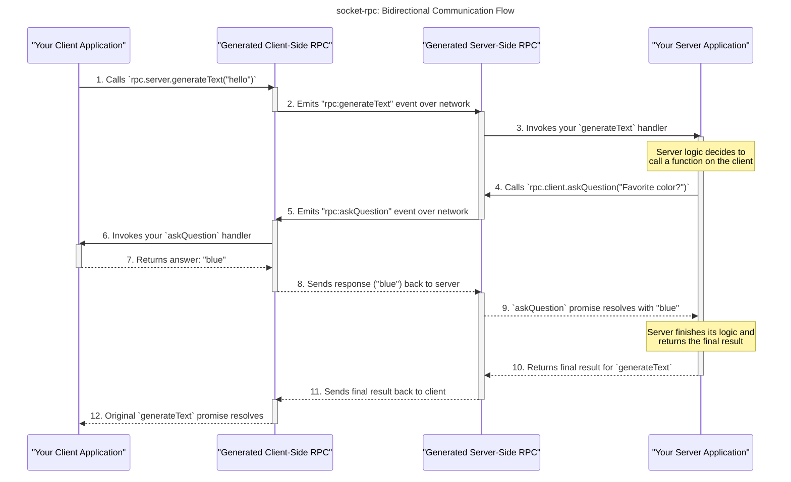

# Socket RPC

[](https://badge.fury.io/js/socketrpc-gen)

`socket-rpc` is a powerful command-line tool that automatically generates a type-safe RPC (Remote Procedure Call) layer for your client and server applications using `socket.io`. It takes a TypeScript interface as input and generates all the necessary code for you to communicate between your client and server with full type safety. It's unopinionated, meaning it only generates the function bindings and doesn't interfere with your existing `socket.io` configuration.

## Features

-   **Type-Safe:** Full static type checking for your RPC calls, powered by TypeScript.
-   **Auto-generation:** Automatically generates client and server code from a single TypeScript interface definition.
-   **Ergonomic API:** Clean `client.handle.*` / `client.server.*` pattern with automatic cleanup.
-   **Unopinionated:** Generates only the type-safe bindings, leaving you in full control of your `socket.io` setup.
-   **Bidirectional Communication:** Supports both client-to-server and server-to-client RPC calls.
-   **Simple to Use:** Get started with a single command.
-   **Error Handling:** Built-in error handling with `RpcError` type.

## Getting Started

The `examples/00-full-app` directory in this repository is a complete working application that can be used as a template to bootstrap your own project. It demonstrates a practical project structure with actual client/server implementation that you can adapt for your needs.

### Examples

Check out the [`examples/`](./examples) directory for comprehensive examples:

- **[00-full-app](./examples/00-full-app/)** - Complete working application with client/server implementation
- **[01-basic](./examples/01-basic/)** - Simple interface definitions without extension
- **[02-single-extension](./examples/02-single-extension/)** - Single-level interface inheritance
- **[03-multi-level-extension](./examples/03-multi-level-extension/)** - Multi-layer architecture patterns

See the [examples README](./examples/README.md) for detailed comparisons and use cases.

### 1. Define Your RPC Interface

Create a TypeScript file (e.g., `pkg/rpc/define.ts`) that defines the functions your server and client will expose.

```typescript
// pkg/rpc/define.ts

/**
 * Interface defining the functions available on the RPC server
 * These functions can be called remotely by RPC clients
 */
interface ServerFunctions {
  /**
   * Generates text based on the provided prompt
   */
  generateText: (prompt: string) => string;
}

/**
 * Interface defining the functions available on the RPC client
 * These functions can be called by the RPC server to interact with the client
 */
interface ClientFunctions {
  /**
   * Displays an error to the client user interface
   */
  showError: (error: Error) => void;

  /**
   * Asks the client a question and expects a response.
   * @param question The question to ask the client.
   * @returns The client's answer to the question.
   */
  askQuestion: (question: string) => string;
}
```

**Important Note:** Do not use `Promise` in the return types when defining functions in your interfaces (`ServerFunctions`, `ClientFunctions`). The library automatically wraps the return types in `Promise`. The implementation of these functions can be `async` and return a `Promise`, but the definition should specify the final resolved type. For example, use `(prompt: string) => string` instead of `(prompt: string) => Promise<string>`.

### 2. Run the Generator

Use the `socketrpc-gen` CLI to generate the RPC code. The generator automatically infers the output directory from the input file path.

```bash
bunx socketrpc-gen <path-to-your-interface-file> [options]
```

For example:

```bash
bunx socketrpc-gen ./examples/00-full-app/pkg/rpc/define.ts
```

This will generate a new package in the `examples/00-full-app/pkg/rpc` directory containing the generated client and server code.

## Example Usage



### Server

Use `createRpcServer()` to create an ergonomic server instance with `.handle` for handlers and `.client` for client methods.

```typescript
// pkg/server/index.ts
import { createServer } from "http";
import { Server } from "socket.io";
import { createRpcServer } from "@socket-rpc/rpc/server.generated";
import { isRpcError, RpcError } from "@socket-rpc/rpc";

const httpServer = createServer();
const io = new Server(httpServer);

io.on("connection", async (socket) => {
  const rpc = createRpcServer(socket);

  // Handle the `generateText` RPC call from the client
  rpc.handle.generateText(async (prompt): Promise<string | RpcError> => {
    // Example of server calling a client function and waiting for a response
    const clientResponse = await rpc.client.askQuestion("What is your favorite color?");

    if (isRpcError(clientResponse)) {
      console.error("Client returned an error:", clientResponse.message);
    } else {
      console.log(`Client's favorite color is: ${clientResponse}`);
    }

    // Example of server calling a fire-and-forget client function
    rpc.client.showError(new Error("This is a test error from the server!"));

    if (prompt === "error") {
      return {
        code: "custom_error",
        message: "This is a custom error",
        data: { a: 1 },
      } as RpcError;
    } else if (prompt === "throw") {
      throw new Error("This is a thrown error");
    }

    return `Server received: ${prompt}`;
  });
});

httpServer.listen(8080, () => {
  console.log("Server running on http://localhost:8080");
});
```

### Client

Use `createRpcClient()` to create an ergonomic client instance. Call `.dispose()` to clean up all handlers.

```typescript
// pkg/client/index.ts
import { io } from "socket.io-client";
import { createRpcClient } from "@socket-rpc/rpc/client.generated";
import { isRpcError } from "@socket-rpc/rpc";

const socket = io("http://localhost:8080");
const rpc = createRpcClient(socket);

// Register handlers using rpc.handle.* (for calls FROM server)
rpc.handle.showError(async (error) => {
  console.error("Server sent an error:", error.message);
});

rpc.handle.askQuestion(async (question) => {
  console.log(`Server asked: ${question}`);
  return "blue"; // Answer the server's question
});

// Make RPC calls using rpc.server.* (calls TO server)
socket.on("connect", async () => {
  console.log("Connected to the server!");

  const response = await rpc.server.generateText("Hello, server!");

  if (isRpcError(response)) {
    console.error("RPC Error:", response);
  } else {
    console.log("Server responded:", response);
  }
});

// Clean up when done (e.g., on page unload)
window.addEventListener("beforeunload", () => {
  rpc.dispose();
});
```

## CLI Reference

### `socketrpc-gen`

Generates the RPC code from interface definitions.

**Usage:**

```
socketrpc-gen <path> [options]
```

**Arguments:**

-   `<path>`: Path to the input TypeScript file containing interface definitions. (Required)

**Options:**

-   `-p, --package-name <name>`: The npm package name for the generated RPC code. (Default: "@socket-rpc/rpc")
-   `-t, --timeout <ms>`: Default timeout in milliseconds for RPC calls that expect a response. This can be overridden per-call. (Default: "5000")
-   `-l, --error-logger <path>`: Custom error logger import path (e.g., '@/lib/logger'). By default uses `console.error`.
-   `-w, --watch`: Watch for changes in the definition file and regenerate automatically. (Default: false)
-   `-h, --help`: Display help for command.

## Framework Integration

The generated `createRpcClient()` / `createRpcServer()` returns an object with a `.dispose()` method that cleans up all handlers. Integrate this with your framework's lifecycle hooks.

### Vue 3 Composition API

```typescript
import { onBeforeUnmount } from 'vue';
import { socket } from './socket';
import { createRpcClient } from './rpc/client.generated';

export default {
  setup() {
    const rpc = createRpcClient(socket);

    // Register handlers - no manual cleanup tracking needed!
    rpc.handle.showError(async (error) => {
      console.error('Error:', error);
    });

    rpc.handle.askQuestion(async (question) => {
      return 'blue';
    });

    // Single cleanup call handles everything
    onBeforeUnmount(() => rpc.dispose());

    return { rpc };
  }
}
```

### React Hooks

```typescript
import { useEffect, useRef } from 'react';
import { socket } from './socket';
import { createRpcClient, RpcClient } from './rpc/client.generated';

function MyComponent() {
  const rpcRef = useRef<RpcClient>();

  useEffect(() => {
    const rpc = createRpcClient(socket);
    rpcRef.current = rpc;

    // Register handlers
    rpc.handle.showError(async (error) => {
      console.error('Error:', error);
    });

    rpc.handle.askQuestion(async (question) => {
      return 'blue';
    });

    // Cleanup on unmount
    return () => rpc.dispose();
  }, []);

  return <div>My Component</div>;
}
```

### Plain JavaScript/TypeScript

```typescript
import { socket } from './socket';
import { createRpcClient } from './rpc/client.generated';

const rpc = createRpcClient(socket);

// Register handlers (for calls FROM server)
rpc.handle.showError(async (error) => {
  console.error('Error:', error);
});

// Make calls (TO server)
const result = await rpc.server.generateText("Hello!");

// Clean up when done
rpc.dispose();
```

## API Reference

### `createRpcClient(socket)`

Creates an ergonomic client RPC interface.

**Returns:** `RpcClient` with the following properties:

| Property | Type | Description |
|----------|------|-------------|
| `handle` | `RpcClientHandle` | Register handlers for server-to-client calls |
| `server` | `RpcClientServer` | Call server methods |
| `socket` | `Socket` | The underlying socket instance |
| `disposed` | `boolean` | Whether this instance has been disposed |
| `dispose()` | `() => void` | Cleanup all registered handlers |

### `createRpcServer(socket)`

Creates an ergonomic server RPC interface.

**Returns:** `RpcServer` with the following properties:

| Property | Type | Description |
|----------|------|-------------|
| `handle` | `RpcServerHandle` | Register handlers for client-to-server calls |
| `client` | `RpcServerClient` | Call client methods |
| `socket` | `Socket` | The underlying socket instance |
| `disposed` | `boolean` | Whether this instance has been disposed |
| `dispose()` | `() => void` | Cleanup all registered handlers |

## How It Works

The `socket-rpc` tool works by parsing your TypeScript interface file and generating a set of functions and handlers that wrap the `socket.io` communication layer.

-   For each function in your `ServerFunctions` interface, it generates:
    -   A handler registration method on `rpc.handle.<functionName>` (server-side)
    -   A call method on `rpc.server.<functionName>` (client-side)
-   For each function in your `ClientFunctions` interface, it generates:
    -   A handler registration method on `rpc.handle.<functionName>` (client-side)
    -   A call method on `rpc.client.<functionName>` (server-side)

This approach provides a clean and type-safe way to communicate between your client and server, without having to write any boilerplate `socket.io` code yourself. It automatically handles acknowledgments for functions that return values and uses fire-and-forget for `void` functions.

## Common Patterns

### Error Handling with RpcError

**Important:** The generated code automatically handles errors through the `RpcError` type. You **don't need** to create wrapper response types with error fields.

#### Bad: Don't Do This

```typescript
// WRONG - Don't create wrapper types with error fields
export type UpdateRotationResponse = {
  success: boolean;
  rotation?: RotationSettings;
  error?: string;
};

interface ServerFunctions {
  updateRotation: (settings: RotationSettings) => UpdateRotationResponse;
}
```

#### Good: Use RpcError

```typescript
// CORRECT - Return the actual data type, errors are handled by RpcError
interface ServerFunctions {
  updateRotation: (settings: RotationSettings) => RotationSettings;
}
```

#### Implementation Example

**Server Handler:**
```typescript
import { createRpcServer } from './rpc/server.generated';
import { RpcError } from './rpc/types.generated';

const rpc = createRpcServer(socket);

rpc.handle.updateRotation(async (settings): Promise<RotationSettings | RpcError> => {
  // Validate settings
  if (!settings.interval || settings.interval < 1000) {
    return {
      code: 'INVALID_INTERVAL',
      message: 'Interval must be at least 1000ms',
      data: { minInterval: 1000 }
    } as RpcError;
  }

  // Update rotation settings
  const updatedRotation = await db.updateRotation(settings);

  // Return success data directly
  return updatedRotation;
});
```

**Client Usage:**
```typescript
import { createRpcClient } from './rpc/client.generated';
import { isRpcError } from './rpc/types.generated';

const rpc = createRpcClient(socket);

const result = await rpc.server.updateRotation({ interval: 5000, enabled: true });

if (isRpcError(result)) {
  // Handle error
  console.error(`Error: ${result.message} (code: ${result.code})`);
  if (result.data) {
    console.error('Additional data:', result.data);
  }
} else {
  // Handle success - result is typed as RotationSettings
  console.log('Rotation updated:', result);
}
```

#### Benefits of Using RpcError

- **Cleaner Types**: Your function signatures return actual data types, not wrapper objects
- **Built-in Type Guards**: Use `isRpcError()` to check for errors
- **Consistent Error Structure**: All errors have `code`, `message`, and optional `data`
- **Type Safety**: TypeScript knows the exact type after `isRpcError()` check
- **Error Codes**: Attach custom error codes for better error handling
- **Additional Context**: Include extra data in the `data` field for debugging

### Sync vs Async Communication

**Synchronous Pattern (Request-Response)**
Use this pattern when you need to wait for a response:

```typescript
// define.ts
interface ServerFunctions {
  getData: (id: string) => UserData;
}

// client usage
const data = await rpc.server.getData("user-123");
```

**Asynchronous Pattern (Fire-and-Forget with Callback)**
Use this pattern for streaming or progressive updates. Declare the server function as `void` and create a client callback to receive responses:

```typescript
// define.ts
interface ServerFunctions {
  startStreaming: (topic: string) => void; // Fire-and-forget
}

interface ClientFunctions {
  onStreamData: (data: StreamChunk) => void; // Callback for receiving stream data
  onStreamEnd: () => void; // Callback when stream ends
}
```

### Streaming Simulation Example

Here's a complete example showing how to simulate streaming data from server to client:

**1. Interface Definition (`pkg/rpc/define.ts`)**

```typescript
interface StreamChunk {
  id: number;
  content: string;
  timestamp: number;
}

interface ServerFunctions {
  startDataStream: (topic: string) => void; // Initiate streaming (fire-and-forget)
  stopDataStream: () => void; // Stop streaming
}

interface ClientFunctions {
  onStreamChunk: (chunk: StreamChunk) => void; // Receive stream data
  onStreamComplete: (totalChunks: number) => void; // Stream finished
  onStreamError: (error: string) => void; // Stream error
}
```

**2. Server Implementation**

```typescript
import { createRpcServer } from "@socket-rpc/rpc/server.generated";

io.on("connection", (socket) => {
  const rpc = createRpcServer(socket);
  let streamInterval: NodeJS.Timeout | null = null;

  // Handle stream start request
  rpc.handle.startDataStream(async (topic) => {
    console.log(`Starting stream for topic: ${topic}`);

    let chunkId = 0;
    const maxChunks = 10;

    streamInterval = setInterval(() => {
      if (chunkId >= maxChunks) {
        clearInterval(streamInterval!);
        streamInterval = null;

        // Notify client that stream is complete
        rpc.client.onStreamComplete(maxChunks);
        return;
      }

      // Send stream chunk to client
      rpc.client.onStreamChunk({
        id: chunkId++,
        content: `Data chunk for ${topic} #${chunkId}`,
        timestamp: Date.now()
      });
    }, 500);
  });

  // Handle stream stop request
  rpc.handle.stopDataStream(async () => {
    if (streamInterval) {
      clearInterval(streamInterval);
      streamInterval = null;
      console.log("Stream stopped by client request");
    }
  });

  // Clean up on disconnect
  socket.on("disconnect", () => {
    if (streamInterval) clearInterval(streamInterval);
    rpc.dispose();
  });
});
```

**3. Client Implementation**

```typescript
import { createRpcClient } from "@socket-rpc/rpc/client.generated";

const socket = io("http://localhost:8080");
const rpc = createRpcClient(socket);

// Set up stream handlers (for calls FROM server)
rpc.handle.onStreamChunk(async (chunk) => {
  console.log(`Received chunk ${chunk.id}: ${chunk.content}`);
});

rpc.handle.onStreamComplete(async (totalChunks) => {
  console.log(`Stream completed! Received ${totalChunks} chunks total.`);
});

rpc.handle.onStreamError(async (error) => {
  console.error("Stream error:", error);
});

socket.on("connect", () => {
  // Start streaming data (call TO server)
  rpc.server.startDataStream("user-activity");

  // Stop stream after 8 seconds
  setTimeout(() => {
    rpc.server.stopDataStream();
  }, 8000);
});

// Cleanup
window.addEventListener("beforeunload", () => rpc.dispose());
```

This pattern enables real-time data streaming while maintaining type safety. The server uses fire-and-forget functions to initiate streams, then uses client callback functions to progressively send data chunks.

### Using with Zod (AI Framework Compatibility)

Many AI frameworks like [Claude Agent SDK](https://github.com/anthropics/anthropic-sdk-python) use [Zod](https://zod.dev/) for structured outputs. If you're already using Zod schemas in your AI workflow, you can reuse them with socket-rpc by inferring TypeScript types from your schemas.

**Example: Reusing Zod Schemas from AI Framework**

```typescript
// pkg/rpc/define.ts
import { z } from 'zod';

// Your existing Zod schemas (already defined for AI structured outputs)
export const PlanSchema = z.object({
  id: z.string(),
  name: z.string(),
  description: z.string()
});

export const GenerateRequestSchema = z.object({
  prompt: z.string(),
  maxTokens: z.number().optional()
});

export const GenerateResponseSchema = z.object({
  text: z.string(),
  usage: z.object({
    inputTokens: z.number(),
    outputTokens: z.number()
  })
});

// Infer TypeScript types from Zod schemas
export type Plan = z.infer<typeof PlanSchema>;
export type GenerateRequest = z.infer<typeof GenerateRequestSchema>;
export type GenerateResponse = z.infer<typeof GenerateResponseSchema>;

// Use inferred types in your interfaces
interface ServerFunctions {
  generate: (request: GenerateRequest) => GenerateResponse;
  getPlan: (planId: string) => Plan;
}

interface ClientFunctions {
  onProgress: (progress: number) => void;
}
```

This approach gives you a single source of truth: your Zod schemas define the structure, and TypeScript types are derived from them. No duplication, full compatibility with both your AI framework and socket-rpc.

