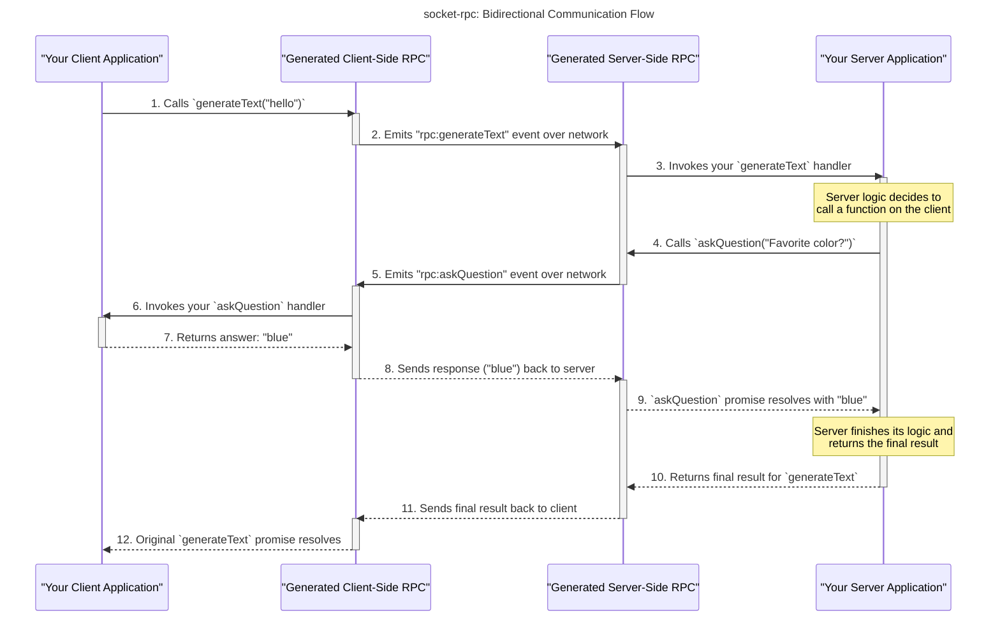

# Socket RPC

[](https://badge.fury.io/js/socketrpc-gen)

`socket-rpc` is a powerful command-line tool that automatically generates a type-safe RPC (Remote Procedure Call) layer for your client and server applications using `socket.io`. It takes a TypeScript interface as input and generates all the necessary code for you to communicate between your client and server with full type safety. It's unopinionated, meaning it only generates the function bindings and doesn't interfere with your existing `socket.io` configuration.

## Features

-   **Type-Safe:** Full static type checking for your RPC calls, powered by TypeScript.
-   **Auto-generation:** Automatically generates client and server code from a single TypeScript interface definition.
-   **Unopinionated:** Generates only the type-safe bindings, leaving you in full control of your `socket.io` setup.
-   **Bidirectional Communication:** Supports both client-to-server and server-to-client RPC calls.
-   **Simple to Use:** Get started with a single command.
-   **Error Handling:** Built-in error handling with `RpcError` type.

## Getting Started

The `example` directory in this repository is a great starting point and can be used as a template to bootstrap your own project. It demonstrates a practical project structure that you can adapt for your needs.

### 1. Define Your RPC Interface

Create a TypeScript file (e.g., `pkg/rpc/define.ts`) that defines the functions your server and client will expose.

```typescript
// pkg/rpc/define.ts

/**
 * Interface defining the functions available on the RPC server
 * These functions can be called remotely by RPC clients
 */
interface ServerFunctions {
  /**
   * Generates text based on the provided prompt
   */
  generateText: (prompt: string) => string;
}

/**
 * Interface defining the functions available on the RPC client
 * These functions can be called by the RPC server to interact with the client
 */
interface ClientFunctions {
  /**
   * Displays an error to the client user interface
   */
  showError: (error: Error) => void;

  /**
   * Asks the client a question and expects a response.
   * @param question The question to ask the client.
   * @returns The client's answer to the question.
   */
  askQuestion: (question: string) => string;
}
```

**Important Note:** Do not use `Promise` in the return types when defining functions in your interfaces (`ServerFunctions`, `ClientFunctions`). The library automatically wraps the return types in `Promise`. The implementation of these functions can be `async` and return a `Promise`, but the definition should specify the final resolved type. For example, use `(prompt: string) => string` instead of `(prompt: string) => Promise<string>`.

### 2. Run the Generator

Use the `socketrpc-gen` CLI to generate the RPC code. The generator automatically infers the output directory from the input file path.

```bash
bunx socketrpc-gen <path-to-your-interface-file> [options]
```

For example:

```bash
bunx socketrpc-gen ./example/pkg/rpc/define.ts
```

This will generate a new package in the `example/pkg/rpc` directory containing the generated client and server code.

## Example Usage



### Server

Implement the server-side functions and use the generated handlers to process client requests.

```typescript
// pkg/server/index.ts
import { createServer } from "http";
import { Server } from "socket.io";
import {
  handleGenerateText,
  showError,
  askQuestion,
} from "@socket-rpc/rpc/server.generated";
import { RpcError, isRpcError } from "@socket-rpc/rpc";

const httpServer = createServer();
const io = new Server(httpServer);

io.on("connection", async (socket) => {
  // Handle the `generateText` RPC call from the client
  handleGenerateText(
    socket,
    async (prompt: string): Promise<string | RpcError> => {
      // Example of server calling a client function and waiting for a response
      try {
        const clientResponse = await askQuestion(
          socket,
          "What is your favorite color?",
          3000
        ); // 3s timeout
        if (isRpcError(clientResponse)) {
          console.error("Client returned an error:", clientResponse.message);
        } else {
          console.log(`Client's favorite color is: ${clientResponse}`);
        }
      } catch (e) {
        console.error("Did not get a response from client for askQuestion", e);
      }

      // Example of server calling a fire-and-forget client function
      showError(socket, new Error("This is a test error from the server!"));

      if (prompt === "error") {
        return {
          code: "custom_error",
          message: "This is a custom error",
          data: { a: 1 },
        } as RpcError;
      } else if (prompt === "throw") {
        throw new Error("This is a thrown error");
      }
      return `Server received: ${prompt}`;
    }
  );
});

httpServer.listen(8080, () => {
  console.log("Server running on http://localhost:8080");
});
```

### Client

Use the generated functions to call server methods and handle server-initiated calls.

```typescript
// pkg/client/index.ts
import { io } from "socket.io-client";
import {
  generateText,
  handleShowError,
  handleAskQuestion,
} from "@socket-rpc/rpc/client.generated";
import { isRpcError } from "@socket-rpc/rpc";

const socket = io("http://localhost:8080");

// --- Best Practice: Đăng ký các trình xử lý sự kiện MỘT LẦN ở đây ---

// Xử lý RPC `showError` từ server
handleShowError(socket, async (error: Error): Promise<void> => {
  console.error("Server sent an error:", error.message);
});

// Xử lý RPC `askQuestion` từ server (và gửi trả lời)
handleAskQuestion(socket, async (question: string) => {
  console.log(`Server asked: ${question}`);
  return "blue"; // Trả lời câu hỏi của server
});


// --- Logic chạy mỗi khi kết nối thành công (hoặc kết nối lại) sẽ nằm trong này ---
socket.on("connect", async () => {
  console.log("Connected to the server!");

  // Gọi hàm `generateText` trên server
  const response = await generateText(socket, "Hello, server!", 10000); // 10s timeout
  if (isRpcError(response)) {
    console.error("RPC Error:", response);
  } else {
    console.log("Server responded:", response);
  }
});

socket.on("disconnect", (reason) => {
    console.log(`Disconnected from server: ${reason}`);
});
```

## CLI Reference

### `socketrpc-gen`

Generates the RPC code from interface definitions.

**Usage:**

```
socketrpc-gen <path> [options]
```

**Arguments:**

-   `<path>`: Path to the input TypeScript file containing interface definitions. (Required)

**Options:**

-   `-p, --package-name <name>`: The npm package name for the generated RPC code. (Default: "@socket-rpc/rpc")
-   `-t, --timeout <ms>`: Default timeout in milliseconds for RPC calls that expect a response. This can be overridden per-call. (Default: "5000")
-   `-w, --watch`: Watch for changes in the definition file and regenerate automatically. (Default: false)
-   `-h, --help`: Display help for command.

## How It Works

The `socket-rpc` tool works by parsing your TypeScript interface file and generating a set of functions and handlers that wrap the `socket.io` communication layer.

-   For each function in your `ServerFunctions` interface, it generates:
    -   A `handle<FunctionName>` function for the server to process incoming requests.
    -   A `<functionName>` function for the client to call the server method.
-   For each function in your `ClientFunctions` interface, it generates:
    -   A `handle<FunctionName>` function for the client to process incoming requests from the server.
    -   A `<functionName>` function for the server to call the client method.

This approach provides a clean and type-safe way to communicate between your client and server, without having to write any boilerplate `socket.io` code yourself. It automatically handles acknowledgments for functions that return values and uses fire-and-forget for `void` functions. 
