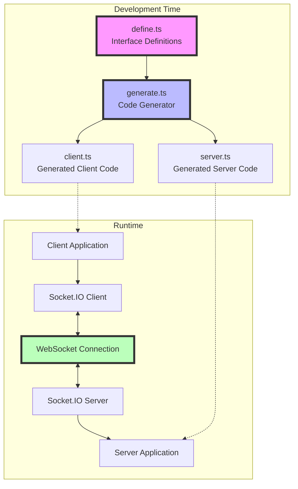

# Socket RPC Template

Một framework TypeScript-based Socket.IO RPC để xây dựng ứng dụng client-server real-time với type-safe remote procedure calls.

## 📋 Mục Lục

1. [Tổng Quan](#tổng-quan)
2. [Kiến Trúc Hệ Thống](#kiến-trúc-hệ-thống)
3. [Cấu Trúc Dự Án](#cấu-trúc-dự-án)
4. [Cách Hoạt Động](#cách-hoạt-động)
5. [Hướng Dẫn Sử Dụng Chi Tiết](#hướng-dẫn-sử-dụng-chi-tiết)
6. [Code Generation](#code-generation)
7. [Triển Khai](#triển-khai)
8. [Ví Dụ Thực Tế](#ví-dụ-thực-tế)
9. [Best Practices](#best-practices)
10. [Troubleshooting](#troubleshooting)

## 🎯 Tổng Quan

Socket RPC Template là một framework giúp bạn xây dựng ứng dụng client-server với Socket.IO một cách type-safe và hiệu quả. Thay vì phải viết code Socket.IO thủ công với các event emitter/listener phức tạp, framework này cho phép bạn:

- ✍️ **Định nghĩa interfaces** một lần trong TypeScript
- 🔧 **Tự động generate** client và server functions
- 🚀 **Sử dụng RPC calls** như gọi hàm thông thường với full type safety
- 🛡️ **Type-safe** từ client đến server và ngược lại
- ⚡ **Real-time** communication với WebSocket
- 🔄 **Bi-directional** - cả client và server đều có thể gọi functions của nhau

### Ưu điểm chính:

1. **Type Safety**: Không còn lỗi typo trong event names hay sai kiểu dữ liệu
2. **Developer Experience**: IntelliSense, auto-completion, và type checking
3. **Code Generation**: Tự động sinh code, giảm boilerplate
4. **Maintainability**: Dễ dàng maintain và refactor
5. **Performance**: Sử dụng WebSocket cho low-latency communication

## 🏗️ Kiến Trúc Hệ Thống



### Luồng hoạt động:

1. **Development**: Developer định nghĩa interfaces → Generator tạo code
2. **Runtime**: Client/Server sử dụng generated code để communicate

## 📁 Cấu Trúc Dự Án

```
socket-rpc/
├── package.json              # Root package với workspace configuration
├── tsconfig.json            # TypeScript config chung
├── index.ts                 # Entry point (demo)
├── README.md               # Documentation
└── pkg/                    # Workspace packages
    ├── rpc/               # Core RPC package
    │   ├── define.ts      # Interface definitions
    │   ├── generate.ts    # Code generator
    │   ├── client.ts      # Generated client functions
    │   ├── server.ts      # Generated server functions
    │   └── index.ts       # Package exports
    ├── server/            # Server implementation
    │   ├── index.ts       # Server entry point
    │   ├── auth.ts        # Authentication middleware
    │   ├── type.d.ts      # TypeScript definitions
    │   ├── Dockerfile     # Container configuration
    │   ├── fly.toml       # Fly.io deployment config
    │   └── deploy.sh      # Deployment script
    └── client/            # Client implementation
        └── index.ts       # Client example
```

### Chi tiết các thành phần:

#### 1. **pkg/rpc** - Core RPC Package
- **define.ts**: Định nghĩa interfaces cho client và server functions
- **generate.ts**: Tool để generate code từ interfaces
- **client.ts**: Generated functions cho client-side
- **server.ts**: Generated functions cho server-side

#### 2. **pkg/server** - Server Implementation
- **index.ts**: Socket.IO server với authentication và RPC handlers
- **auth.ts**: Middleware xác thực cho socket connections
- **type.d.ts**: Extended Socket types với user data
- **Dockerfile**: Build container cho production
- **fly.toml**: Configuration cho Fly.io deployment

#### 3. **pkg/client** - Client Implementation
- **index.ts**: Ví dụ client kết nối và gọi RPC functions

## 🔄 Cách Hoạt Động

### 1. Định nghĩa Interfaces

Trong `pkg/rpc/define.ts`, bạn định nghĩa 2 interfaces:

```typescript
// Functions mà SERVER implement (client gọi)
export interface ServerFunctions {
  generateText: (prompt: string) => string;
  getPlan: (planId: string) => Plan;
}

// Functions mà CLIENT implement (server gọi)
export interface ClientFunctions {
  showError: (error: Error) => void;
  updateDiscoveriedUrls: (url: string) => void;
  getBrowserVersion: () => string;
}
```

### 2. Generate Code

Chạy generator để tạo client/server functions:

```bash
cd pkg/rpc
bun run generate.ts
```

### 3. Generated Code

Generator tạo ra 2 files với các functions:

**client.ts** - Cho client application:
```typescript
// Client gọi server
export async function generateText(socket: Socket, prompt: string, timeout: number = 5000): Promise<string>

// Client xử lý server calls
export function handleShowError(socket: Socket, handler: (error: Error) => void): void
```

**server.ts** - Cho server application:
```typescript
// Server gọi client
export function showError(socket: Socket, error: Error): void

// Server xử lý client calls
export function handleGenerateText(socket: Socket, handler: (prompt: string) => string | Promise<string>): void
```

## 📖 Hướng Dẫn Sử Dụng Chi Tiết

### 1. Setup Project

```bash
# Clone template
git clone <repository-url>
cd socket-rpc

# Install dependencies
bun install

# Generate RPC functions
bun run generate
```

### 2. Định Nghĩa RPC Functions

Chỉnh sửa `pkg/rpc/define.ts`:

```typescript
export interface ServerFunctions {
  // Synchronous function
  calculateSum: (a: number, b: number) => number;
  
  // Async function với Promise
  fetchUserData: (userId: string) => Promise<UserData>;
  
  // Void function (không return)
  logMessage: (message: string, level: LogLevel) => void;
  
  // Complex types
  processOrder: (order: Order) => Promise<OrderResult>;
}

export interface ClientFunctions {
  // UI updates
  updateProgress: (percent: number) => void;
  showNotification: (notification: Notification) => void;
  
  // User interaction
  confirmAction: (message: string) => Promise<boolean>;
  
  // System info
  getSystemInfo: () => SystemInfo;
}
```

### 3. Generate Functions

```bash
# Generate một lần
bun run generate

# Hoặc watch mode (tự động generate khi file thay đổi)
bun run dev
```

### 4. Implement Server

```typescript
// pkg/server/index.ts
import { Server } from "socket.io";
import { 
  handleCalculateSum,
  handleFetchUserData,
  showNotification,
  updateProgress 
} from "@socket-rpc/rpc/server";

const io = new Server(3000, {
  cors: { origin: "*" }
});

io.on("connection", (socket) => {
  // Xử lý client calls
  handleCalculateSum(socket, async (a, b) => {
    return a + b;
  });
  
  handleFetchUserData(socket, async (userId) => {
    const user = await db.users.findById(userId);
    return user;
  });
  
  // Gọi client functions
  showNotification(socket, {
    title: "Welcome!",
    message: "Connected to server"
  });
  
  // Update progress
  let progress = 0;
  const interval = setInterval(() => {
    progress += 10;
    updateProgress(socket, progress);
    
    if (progress >= 100) {
      clearInterval(interval);
    }
  }, 1000);
});
```

### 5. Implement Client

```typescript
// client.ts
import { io } from "socket.io-client";
import {
  calculateSum,
  fetchUserData,
  handleShowNotification,
  handleUpdateProgress
} from "@socket-rpc/rpc/client";

const socket = io("http://localhost:3000");

// Xử lý server calls
handleShowNotification(socket, (notification) => {
  console.log(`${notification.title}: ${notification.message}`);
});

handleUpdateProgress(socket, (percent) => {
  console.log(`Progress: ${percent}%`);
});

// Gọi server functions
socket.on("connect", async () => {
  try {
    // Simple calculation
    const sum = await calculateSum(socket, 5, 3);
    console.log(`Sum: ${sum}`); // Sum: 8
    
    // Fetch data với timeout tùy chỉnh
    const user = await fetchUserData(socket, "user123", 10000);
    console.log(`User: ${user.name}`);
  } catch (error) {
    console.error("RPC Error:", error);
  }
});
```

## 🔧 Code Generation

### Generator Configuration

Generator hỗ trợ nhiều options:

```typescript
import { generateRpcFunctions } from './generate';

generateRpcFunctions({
  inputPath: 'my-types.ts',           // Default: 'define.ts'
  clientOutputPath: 'my-client.ts',   // Default: 'client.ts'
  serverOutputPath: 'my-server.ts',   // Default: 'server.ts'
  defaultTimeout: 10000,              // Default: 5000ms
  generateJSDoc: true,                // Default: true
  generateHandlers: true,             // Default: true
  socketClientImport: 'socket.io-client',
  socketServerImport: 'socket.io'
});
```

### Supported Types

Generator hỗ trợ đầy đủ TypeScript types:

- ✅ Primitive types: `string`, `number`, `boolean`, `void`
- ✅ Complex types: custom interfaces, types, enums
- ✅ Generic types: `Array<T>`, `Promise<T>`, `Record<K,V>`
- ✅ Union types: `string | number`
- ✅ Optional parameters: `name?: string`
- ✅ Async functions: return `Promise<T>`

### Generated Code Structure

Mỗi function được generate với pattern:

**Client → Server:**
```typescript
// Void function - fire and forget
export function logMessage(socket: Socket, message: string): void {
  socket.emit('logMessage', message);
}

// Return function - wait for response
export async function getData(socket: Socket, id: string, timeout: number = 5000): Promise<Data> {
  return socket.timeout(timeout).emitWithAck('getData', id);
}
```

**Server → Client:**
```typescript
// Call client function
export function showAlert(socket: Socket, message: string): void {
  socket.emit('showAlert', message);
}

// Handle client calls
export function handleGetData(socket: Socket, handler: (id: string) => Data | Promise<Data>): void {
  socket.on('getData', async (id, callback) => {
    try {
      const result = await handler(id);
      callback(result);
    } catch (error) {
      callback({ error: error.message });
    }
  });
}
```

## 🚀 Triển Khai

### Local Development

```bash
# Terminal 1 - Start server
cd pkg/server
bun run dev

# Terminal 2 - Run client
cd pkg/client
bun run dev
```

### Production Deployment với Fly.io

1. **Build Docker image:**
```bash
cd pkg/server
bun run build
```

2. **Configure Fly.io:**
```toml
# fly.toml
app = "your-app-name"
primary_region = "sin"

[env]
  PORT = "8080"
  NODE_ENV = "production"
```

3. **Deploy:**
```bash
fly deploy
```

### Environment Variables

Server hỗ trợ các environment variables:

- `PORT`: Server port (default: 8080)
- `NODE_ENV`: Environment mode
- `AUTH_SECRET`: Secret key cho authentication
- `CORS_ORIGIN`: Allowed CORS origins

## 💡 Ví Dụ Thực Tế

### 1. Chat Application

```typescript
// define.ts
export interface ServerFunctions {
  sendMessage: (message: ChatMessage) => void;
  joinRoom: (roomId: string) => Promise<Room>;
  leaveRoom: (roomId: string) => void;
  getOnlineUsers: () => Promise<User[]>;
}

export interface ClientFunctions {
  receiveMessage: (message: ChatMessage) => void;
  userJoined: (user: User) => void;
  userLeft: (userId: string) => void;
  updateUserList: (users: User[]) => void;
}
```

### 2. Real-time Dashboard

```typescript
// define.ts
export interface ServerFunctions {
  subscribeMetrics: (metrics: string[]) => void;
  unsubscribeMetrics: (metrics: string[]) => void;
  getHistoricalData: (metric: string, range: TimeRange) => Promise<DataPoint[]>;
}

export interface ClientFunctions {
  updateMetric: (metric: string, value: number) => void;
  batchUpdateMetrics: (updates: MetricUpdate[]) => void;
  alertThresholdExceeded: (alert: Alert) => void;
}
```

### 3. Collaborative Editor

```typescript
// define.ts
export interface ServerFunctions {
  openDocument: (docId: string) => Promise<Document>;
  saveDocument: (docId: string, content: string) => Promise<void>;
  shareDocument: (docId: string, userId: string) => Promise<ShareLink>;
}

export interface ClientFunctions {
  documentUpdated: (update: DocumentUpdate) => void;
  userCursorMoved: (userId: string, position: CursorPosition) => void;
  userStartedTyping: (userId: string) => void;
  userStoppedTyping: (userId: string) => void;
}
```

## 🎯 Best Practices

### 1. Interface Design

```typescript
// ✅ GOOD - Clear, focused interfaces
export interface ServerFunctions {
  // Group related functions
  // Auth
  login: (credentials: Credentials) => Promise<AuthResult>;
  logout: () => void;
  refreshToken: (token: string) => Promise<string>;
  
  // User operations  
  getUser: (id: string) => Promise<User>;
  updateUser: (id: string, data: UpdateUserData) => Promise<User>;
}

// ❌ BAD - Mixed concerns
export interface ServerFunctions {
  doEverything: (action: string, data: any) => any;
}
```

### 2. Error Handling

```typescript
// Server side
handleGetUser(socket, async (userId) => {
  try {
    const user = await db.users.findById(userId);
    if (!user) {
      throw new Error('User not found');
    }
    return user;
  } catch (error) {
    // Log error server-side
    logger.error('getUser failed:', error);
    // Re-throw với user-friendly message
    throw new Error('Failed to fetch user data');
  }
});

// Client side
try {
  const user = await getUser(socket, userId);
} catch (error) {
  if (error.message.includes('timeout')) {
    showError('Connection timeout. Please try again.');
  } else {
    showError(error.message);
  }
}
```

### 3. Authentication & Security

```typescript
// auth.ts
export const authMiddleware = async (socket: ExtendedSocket, next: (err?: Error) => void) => {
  const token = socket.handshake.auth.token;
  
  if (!token) {
    return next(new Error('No token provided'));
  }
  
  try {
    const decoded = jwt.verify(token, process.env.JWT_SECRET);
    socket.data.userId = decoded.userId;
    socket.data.roles = decoded.roles;
    next();
  } catch (error) {
    return next(new Error('Invalid token'));
  }
};

// Sử dụng trong handlers
handleDeleteUser(socket, async (userId) => {
  // Check permissions
  if (!socket.data.roles.includes('admin')) {
    throw new Error('Unauthorized');
  }
  
  return await db.users.delete(userId);
});
```

### 4. Performance Optimization

```typescript
// Batch updates thay vì individual calls
export interface ClientFunctions {
  // ❌ BAD - Many individual calls
  updatePrice: (productId: string, price: number) => void;
  
  // ✅ GOOD - Batched updates
  updatePrices: (updates: PriceUpdate[]) => void;
}

// Implement throttling/debouncing
const throttledUpdate = throttle((socket, data) => {
  updateMetrics(socket, data);
}, 1000);

// Use rooms for targeted broadcasting
io.to(`room-${roomId}`).emit('message', data);
```

### 5. Type Safety

```typescript
// Define strict types
export type UserId = string & { __brand: 'UserId' };
export type ProductId = string & { __brand: 'ProductId' };

export interface ServerFunctions {
  // Type-safe IDs prevent mixing up parameters
  getUser: (id: UserId) => Promise<User>;
  getProduct: (id: ProductId) => Promise<Product>;
}

// Use enums for constants
export enum LogLevel {
  DEBUG = 'debug',
  INFO = 'info',
  WARN = 'warn',
  ERROR = 'error'
}

export interface ServerFunctions {
  log: (message: string, level: LogLevel) => void;
}
```

## 🐛 Troubleshooting

### Common Issues

#### 1. Connection Errors

```typescript
// Client
socket.on('connect_error', (error) => {
  if (error.type === 'TransportError') {
    console.log('Network issue - check your connection');
  } else if (error.message.includes('Authentication')) {
    console.log('Auth failed - check your token');
  }
});
```

#### 2. Timeout Errors

```typescript
// Increase timeout for slow operations
const data = await fetchLargeData(socket, params, 30000); // 30s timeout
```

#### 3. Type Mismatches

```bash
# Regenerate nếu thay đổi interfaces
bun run generate

# Check TypeScript errors
tsc --noEmit
```

#### 4. CORS Issues

```typescript
// Server config
const io = new Server(httpServer, {
  cors: {
    origin: process.env.CLIENT_URL || "http://localhost:3000",
    credentials: true
  }
});
```

### Debug Mode

```typescript
// Enable Socket.IO debug
localStorage.debug = 'socket.io-client:*';

// Server debug
DEBUG=socket.io:* node server.js
```

### Performance Monitoring

```typescript
// Track RPC performance
const startTime = Date.now();
const result = await someRpcCall(socket, params);
const duration = Date.now() - startTime;
console.log(`RPC call took ${duration}ms`);

// Monitor socket events
socket.onAny((event, ...args) => {
  console.log(`Event: ${event}`, args);
});
```

## 📚 Resources

- [Socket.IO Documentation](https://socket.io/docs/v4/)
- [TypeScript Handbook](https://www.typescriptlang.org/docs/)
- [Bun Documentation](https://bun.sh/docs)
- [Fly.io Documentation](https://fly.io/docs/)

## 📄 License

MIT License - feel free to use this template for your projects!